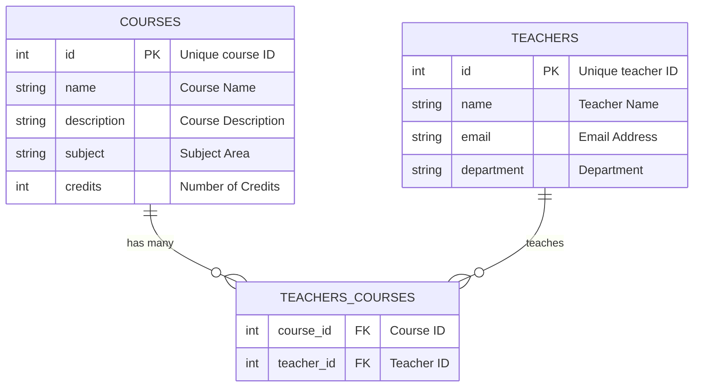
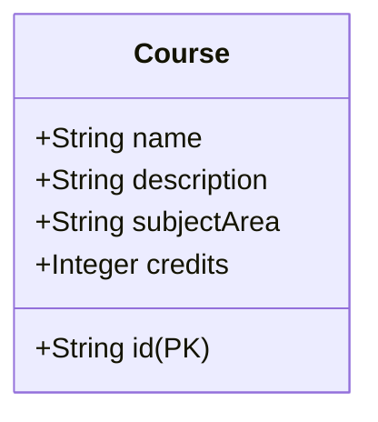
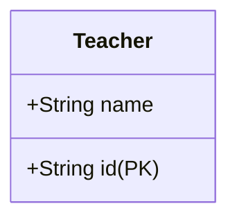

# Courses Data Model

The Courses and Teachers data models represented as tables and a diagram, followed by an outline of the API endpoints in a table format.

#### Diagram (Mermaid)

#### Table (Markdown)
| Field         | Data Type | Description                             | Constraint    |
|---------------|-----------|-----------------------------------------|---------------|
| id            | String    | Unique identifier for the course        | Primary Key   |
| name          | String    | The name of the course                  | Required      |
| description   | String    | A detailed description of the course    | Required      |
| subjectArea   | String    | The subject area the course pertains to | Required      |
| credits       | Integer   | Number of credits the course is worth   | Required      |

### Teachers Data Model

#### Diagram (Mermaid)

*Note:* Attribute names in the class diagram have been simplified to `id` and `name` for clarity and consistency.

#### Table (Markdown)
| Field | Data Type | Description                            | Constraint    |
|-------|-----------|----------------------------------------|---------------|
| id    | String    | Unique identifier for the teacher      | Primary Key   |
| name  | String    | Full name of the teacher               | Required      |

### Task 2: Build Backend API

#### API Endpoints Table (Markdown)

##### Courses API

| Method | Endpoint            | Description                            |
|--------|---------------------|----------------------------------------|
| POST   | `/courses`          | Create a new course                    |
| GET    | `/courses`          | Retrieve all courses                   |
| GET    | `/courses/:id`      | Retrieve details of a specific course  |
| PUT    | `/courses/:id`      | Update a specific course               |
| DELETE | `/courses/:id`      | Delete a specific course               |

##### Teachers API

| Method | Endpoint          | Description                |
|--------|-------------------|----------------------------|
| POST   | `/teachers`       | Register a new teacher     |
| POST   | `/auth/login`     | Authenticate a teacher     |
