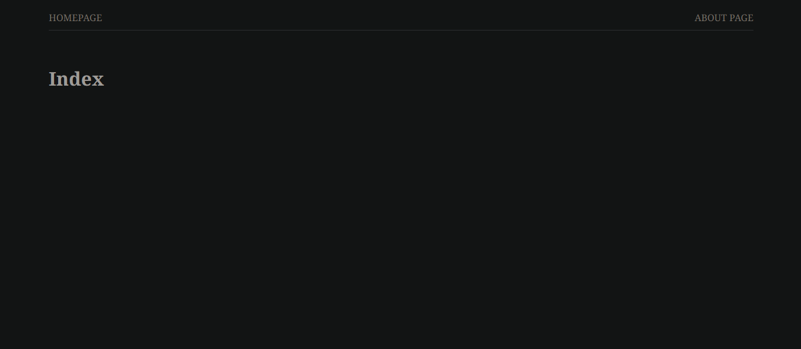

Khristin Schenk
May 5th, 2024
SDEV-255

# M07 Lab: Implementing a Login System

> Objective: *Create a login system in order for users and teachers to login.*

    -  Make sure to separate authorization features based on who the user is.
    -  Make sure that the CRUD functions are secured by only allowing teachers to create, update, and destroy courses.

---

# Version 1.0



```html
<div class="md:w-1/2 px-4 mb-8 md:mb-0">
 <div class="bg-white rounded-lg shadow-md p-6">
  <h3 class="text-xl font-semibold text-gray-800 mb-4">For Students</h3>
  <form onsubmit="return loginUser('student')">
   <input type="email" placeholder="Email" name="email" required class="input-style">
   <input type="password" placeholder="Password" name="password" required class="input-style">
   <input type="submit" value="Log In" class="block w-full bg-indigo-500 hover:bg-indigo-600 text-white font-semibold py-2 px-4 rounded-md text-center">
  </form>
 </div>
</div>
<div class="md:w-1/2 px-4">
 <div class="bg-white rounded-lg shadow-md p-6">
  <h3 class="text-xl font-semibold text-gray-800 mb-4">For Teachers/Staff</h3>
  <form onsubmit="return loginUser('teacher')">
   <input type="email" placeholder="Email" name="email" required class="input-style">
   <input type="password" placeholder="Password" name="password" required class="input-style">
   <input type="submit" value="Log In" class="block w-full bg-indigo-500 hover:bg-indigo-600 text-white font-semibold py-2 px-4 rounded-md text-center">
  </form>
 </div>
</div>
```


```css
.input-style {
 width: 100%;
 padding: 8px;
 margin: 10px 0;
 display: inline-block;
 border: 1px solid #ccc;
 border-radius: 4px;
 box-sizing: border-box;
}
```


```javascript
function loginUser(role) {
 const email = event.target.email.value;
 const password = event.target.password.value;

 // Placeholder validation: In real application, validate against the database
 if (
  email === "teacher@example.com" &&
  password === "password123" &&
  role === "teacher"
 ) {
  window.location.href = "./teacherDashboard.html"; // Redirect to teacher's dashboard
 } else if (
  email === "student@example.com" &&
  password === "password123" &&
  role === "student"
 ) {
  window.location.href = "./studentDashboard.html"; // Redirect to student's dashboard
 } else {
  alert("Invalid credentials or role!");
 }
 return false; // Prevent form submission for demonstration purposes
}
```

---

## Version # 1.5


*This version starts with the code written for the M05 Lab*
    https://kschenk10-ivy-tech.github.io/SDEV-255-M05/