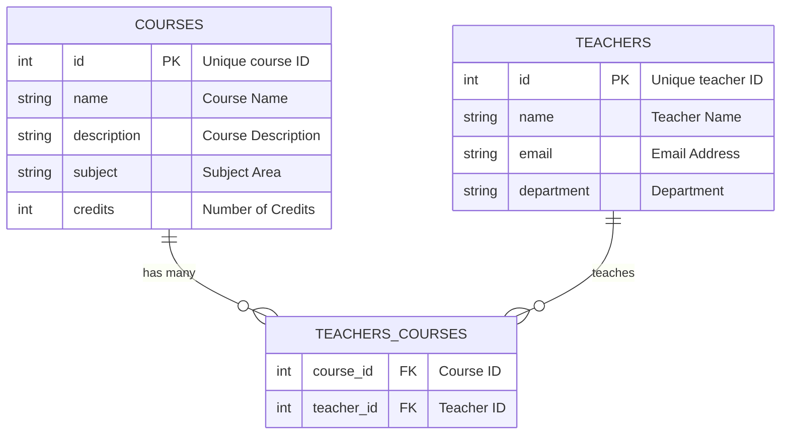

```mermaid
erDiagram
    COURSES ||--o{ TEACHERS_COURSES : "has many"
    TEACHERS ||--o{ TEACHERS_COURSES : "teaches"
    COURSES {
        int id PK "Unique course ID"
        string name "Course Name"
        string description "Course Description"
        string subject "Subject Area"
        int credits "Number of Credits"
    }
    TEACHERS {
        int id PK "Unique teacher ID"
        string name "Teacher Name"
        string email "Email Address"
        string department "Department"
    }
    TEACHERS_COURSES {
        int course_id FK "Course ID"
        int teacher_id FK "Teacher ID"
    }
```
